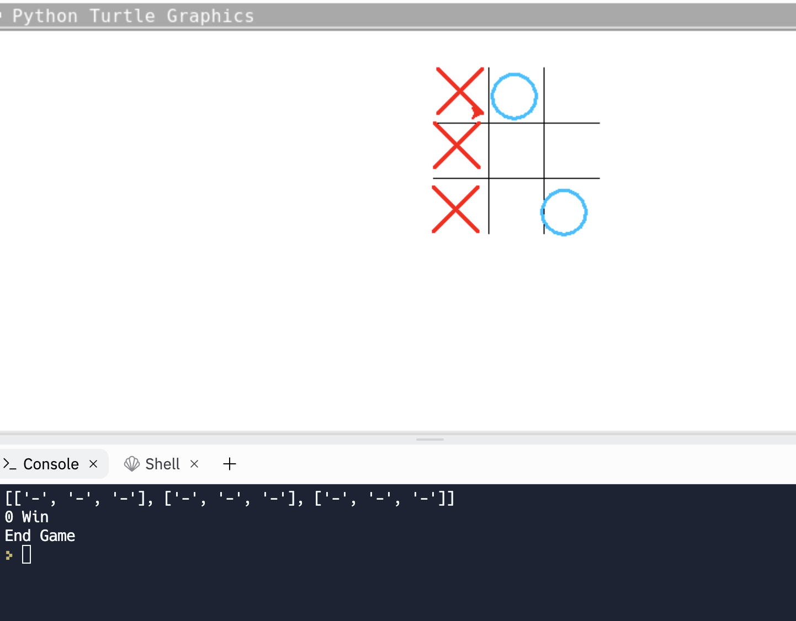
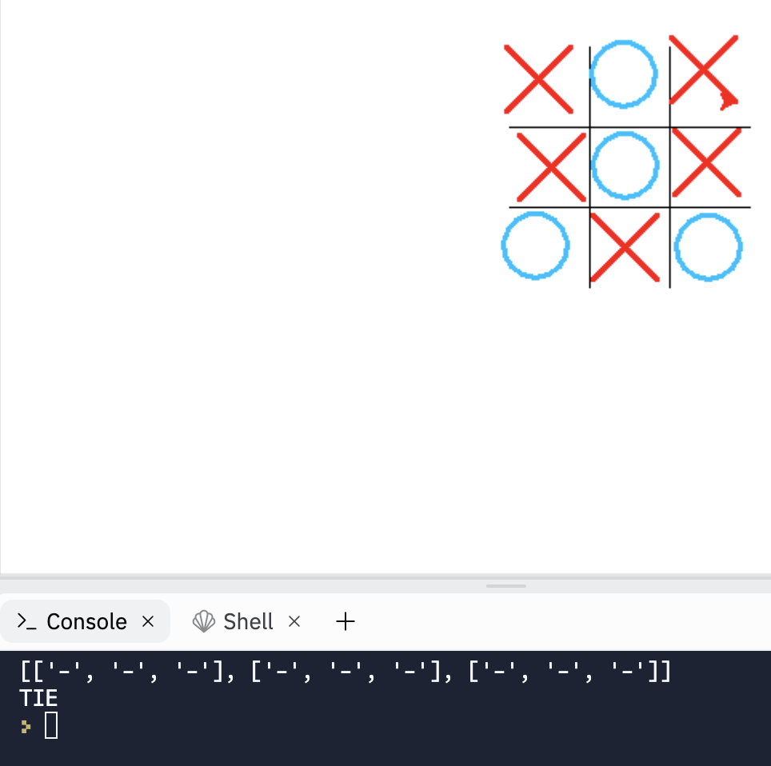
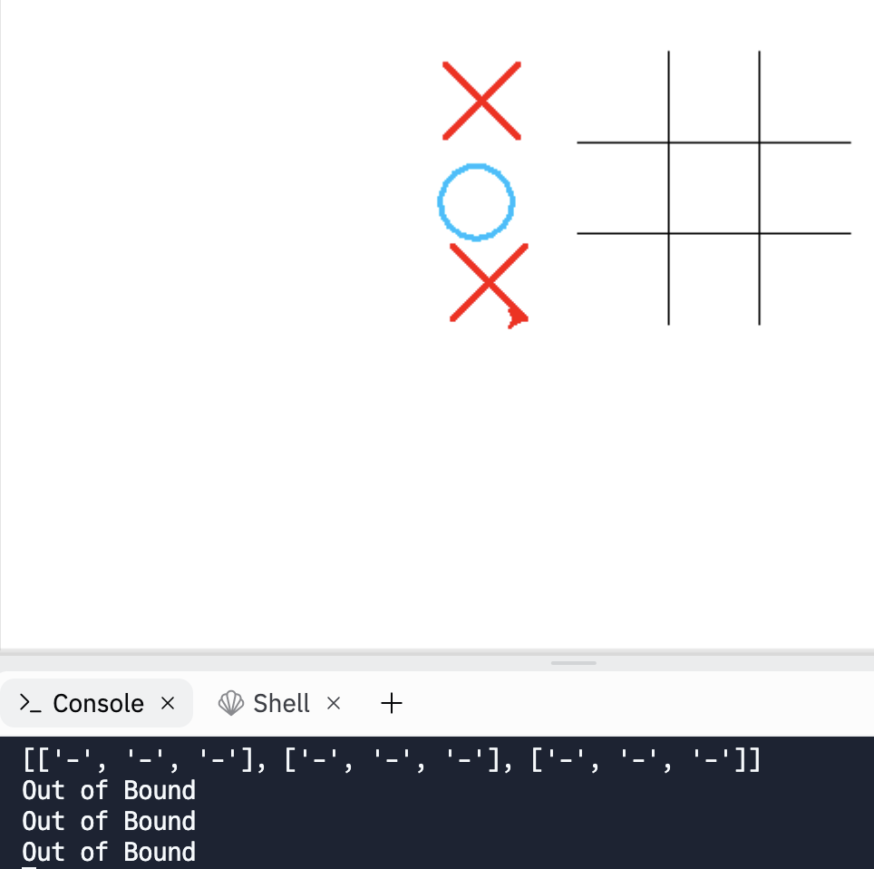

# Toe-Tac-Tic
Tic Tac Toe game written in python using turtle.

Author - Kelvin Zhang

## Screenshots

This shows that one player has won and will tell you at the bottom.

This whos if two players tie on the bottom.

This image shows that if you click outside the board, then it will indicate that it's out of bounds.

## Features
- Having different colors for each playing peice
- Has the ability to switch users per click
- Created with turtle
- Hosted by replit

## Link(s)
[turtle documentation](https://docs.python.org/3/library/turtle.html)

